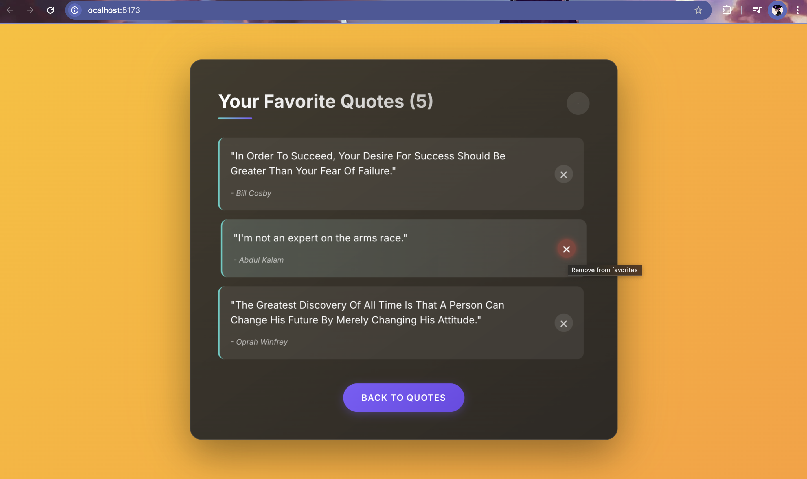
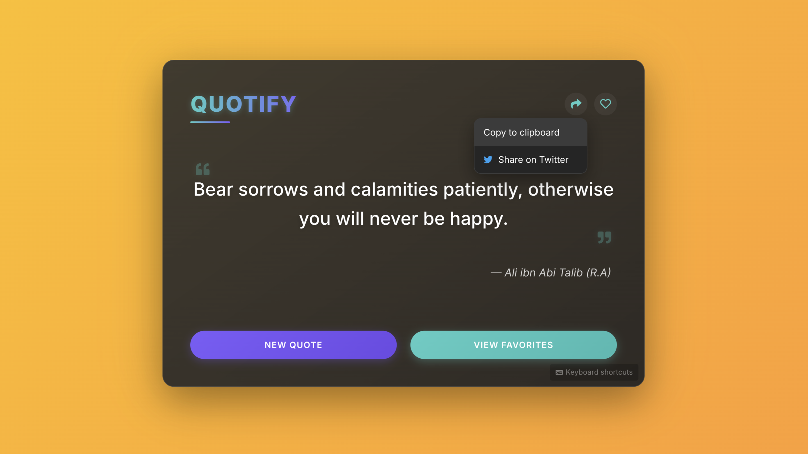
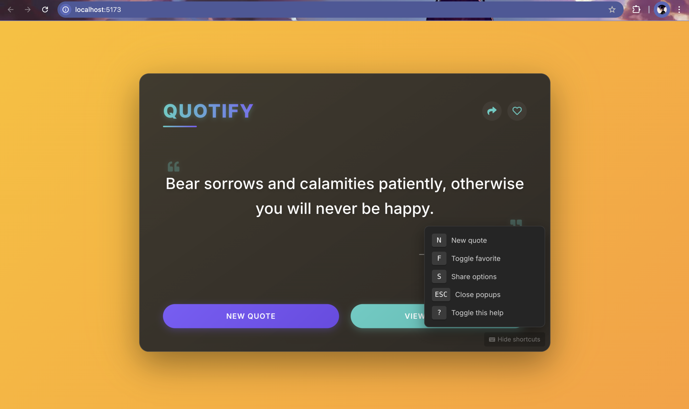

# QUOTIFY - Modern Inspirational Quotes Application

A quote generator application built with React and TypeScript. This project demonstrates the implementation of a modern interface for discovering and saving inspirational quotes with a focus on user experience and clean design.

## Project Overview

Quotify is developed to showcase inspirational quotes in an elegant and user-friendly interface. The application features a responsive design with a modern UI, focusing on both functionality and aesthetic appeal.

## Screenshots

### Main Interface


*Modern interface with elegant quote display and interactive elements*

### Favorites View


*Saved favorite quotes for easy access with the ability to remove individual quotes*

### Share Options


*Convenient sharing functionality for social media*

### Keyboard Shortcuts


*Convenient keyboard shortcuts for power users*

### Offline Mode


*Seamless offline experience with local quotes database*

## Core Features

### Current Implementation
* Quote retrieval from multiple API sources with fallback mechanisms
* **Persistent Storage**: Local storage for saving favorite quotes across sessions
* **Favorites Management**: Add quotes to favorites and remove them individually as needed
* **Offline Support**: Automatic detection of network status with seamless fallback to local quotes
* Responsive design with modern gradient UI elements
* Share quotes via clipboard or Twitter
* Keyboard shortcuts for desktop users
* Error handling and recovery
* Local quotes database as fallback

### Planned Enhancements
* Enhanced quote features
  - Categories and tags for quotes
  - Author information and biography
  - Quote search functionality
* Advanced UI features
  - Custom theme colors
  - Animation transitions
  - User accounts for cloud sync
* Progressive Web App (PWA) implementation

## Technical Stack

* Frontend: React + Vite
* Quotes API: Multiple sources with fallback
* Styling: Custom CSS with modern design principles
* TypeScript: For type safety and better developer experience
* Local Storage: For persistent favorites and app state

## Setup Guide

1. Clone the repository:
```bash
git clone [your-repo-url]
cd quotify-app
```

2. Install dependencies:
```bash
npm install
```

3. Launch development server:
```bash
npm run dev
```

## Development Notes

### API Configuration
The application uses multiple quote APIs with a robust fallback mechanism to ensure quotes are always available, even when offline.

### Offline Functionality
The app detects network status changes and automatically switches between online and offline modes. In offline mode, it uses a curated collection of quotes stored locally, ensuring a seamless user experience regardless of connectivity.

### Best Practices
* Follow TypeScript best practices
* Maintain consistent code style
* Ensure responsive design across all devices
* Implement proper error handling

## Contributing

Contributions are welcome. Please follow these steps:
1. Fork the repository
2. Create a feature branch
3. Submit a pull request with detailed description
4. Ensure all tests pass

## Contact

For inquiries or collaboration opportunities, please reach out through:
anshdevnagar@gmail.com

---
Developed by Ansh Dev Nagar
